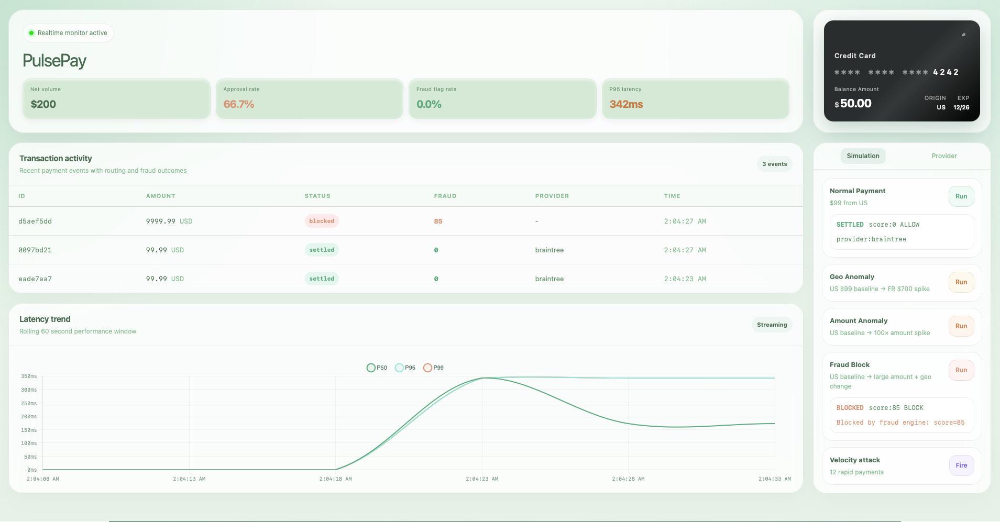
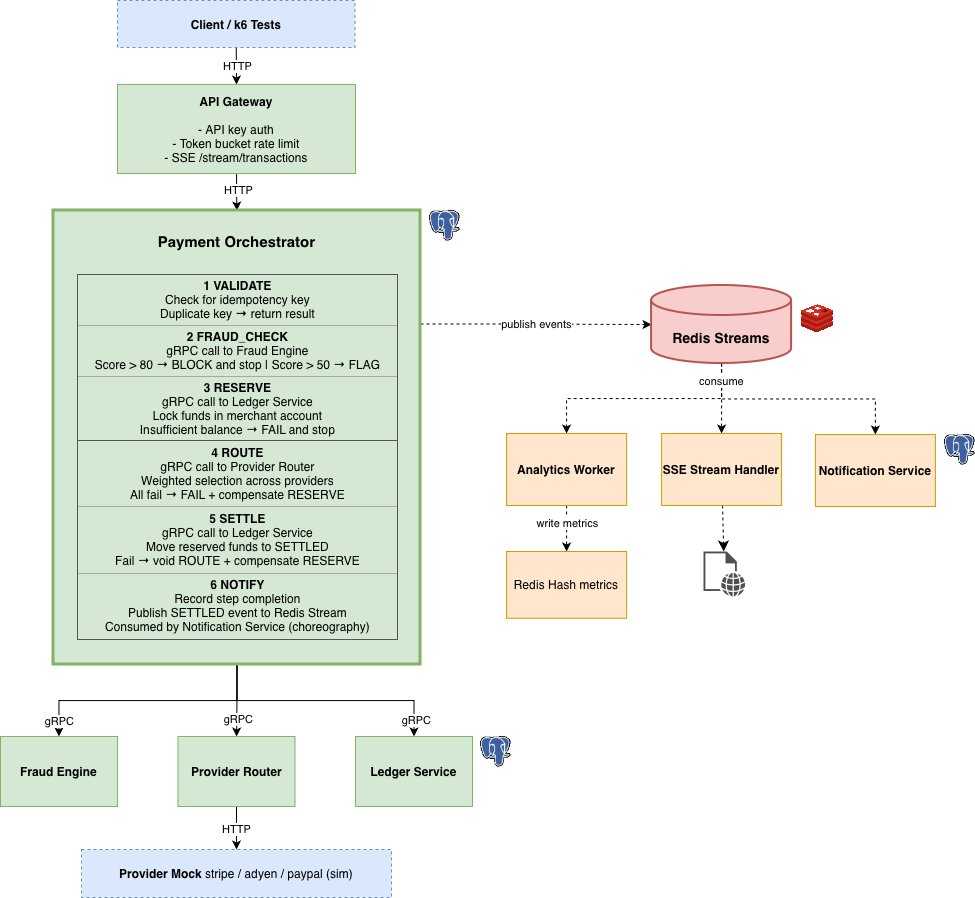
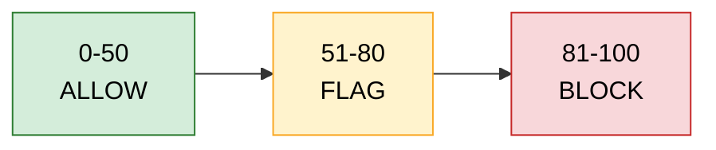
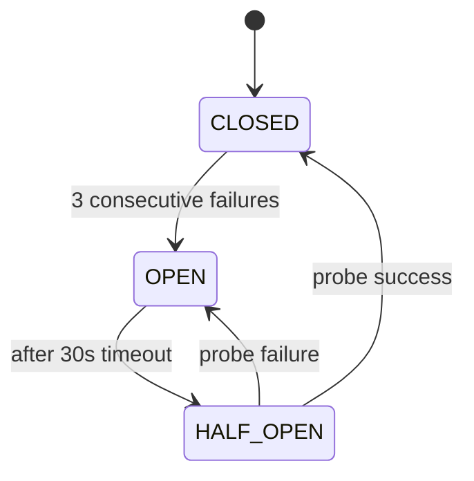

# Distributed Payment Orchestration

>[!Note]
> This project was extended from a hackathon submission. The original version is available [here](https://github.com/jamsamjam/pulsepay).



A payment orchestration platform featuring multi-provider routing, rule-based fraud scoring, SAGA-based distributed transaction management, and circuit breaker failover.

## Architecture



The reasoning behind the main design choices is detailed in [ARCHITECTURE.md](./ARCHITECTURE.md). See that document for a deeper explanation of the architecture and trade-offs.

## Quick Start

```bash
docker compose up --build
```

## API Reference

### Initiate Payment

```
POST /api/v1/payments
X-Api-Key: dev-api-key-12345
Content-Type: application/json

{
  "idempotencyKey": "unique-key",
  "amount": 99.99,
  "currency": "USD",
  "merchantId": "merchant_demo",
  "cardLast4": "4242",
  "cardCountry": "US"
}
```

**Response:**
```json
{
  "transactionId": "uuid",
  "status": "SETTLED | BLOCKED | FAILED",
  "provider": "adyen",
  "fraudScore": 0,
  "fraudDecision": "ALLOW | FLAG | BLOCK",
  "fraudReasons": []
}
```

### Get Transaction

```
GET /api/v1/payments/:id
X-Api-Key: dev-api-key-12345
```

## Services

| Service | Stack | Responsibility |
|---|---|---|
| `api-gateway` | Node.js + Fastify | Auth, rate limiting (configurable via `RATE_LIMIT_MAX_TOKENS`), SSE stream |
| `payment-orchestrator` | Java 21 + Spring Boot |  SAGA, compensation, domain events (gRPC) |
| `fraud-engine` | Python + FastAPI | Fraud scoring 0-100, velocity / geo / amount / time signals |
| `provider-router` | Java 21 + Spring Boot | Weighted routing, per-provider circuit breaker |
| `ledger-service` | Java 21 + Spring Boot | Double-entry bookkeeping, idempotent reserve/settle |
| `analytics-worker` | Node.js | Redis Stream consumer, rolling metrics (60s window) |
| `notification-service` | Node.js + Fastify | Redis Stream consumer, payment notifications, audit log |
| `provider-mock` | Node.js + Fastify | Simulated Stripe / Adyen / PayPal with failure injection |

## Fraud Scoring

Four signals combine for a score 0-100:

| Signal | Max Points | Triggers |
|---|---|---|
| HIGH_VELOCITY | 30 | >10 transactions in 10 minutes |
| ELEVATED_VELOCITY | 15 | >5 transactions in 10 minutes |
| AMOUNT_ANOMALY_EXTREME | 55 | >5× deviation from card's average |
| AMOUNT_ANOMALY | 25 | >2× deviation from card's average |
| GEO_IMPOSSIBLE_TRAVEL | 30 | Different country within 60 minutes |
| ODD_HOURS | 15 | 2am-5am UTC |



> [!Note]
> The signal weights and thresholds here are demo-tuned, not data-calibrated. In production, these would be derived from labelled historical transactions by sweeping thresholds against a ROC curve and choosing an operating point based on acceptable false-positive rate (legitimate transactions blocked) vs. false-negative rate (fraud let through).


## Circuit Breaker

Per-provider state machine:



**Demo:** Click "Inject Failure" on adyen in the dashboard → watch traffic automatically reroute to paypal within 1 failed payment. Click "Recover" to restore adyen.

## Idempotency

Every payment requires an `idempotencyKey`. Sending the same key twice returns the original result without double charge.

<details>
<summary>API Example</summary>

```bash
# Both calls return the same transactionId
curl -X POST .../payments -d '{"idempotencyKey":"key-001", ...}'
curl -X POST .../payments -d '{"idempotencyKey":"key-001", ...}'  # ← same response
```
</details>

## Load Test Results

Tested on a single Apple M2 Pro (all services in Docker on one machine).

| Test | VUs | Duration | Requests | TPS | P50 | P95 | Error Rate | Notes |
|---|---|---|---|---|---|---|---|---|
| Baseline | 50 | 2 min | 3,702 | **30.6 TPS** | 631 ms | 7.34 s | 2.9% [1] | Single machine, steady state |
| Spike | 0→500 | 2 min | 5,312 | **44 TPS** | 8.89 s | 15 s | 18.3% [2] | Saturates above ~50 VUs; timeout ceiling at 15s |
| Failure injection | 50 | 2 min | 4,026 | **33.4 TPS** | - | 6.12 s | 4.4% [3] | Stripe injected at t≈30s; circuit breaker reroutes |

[1] Some errors are fraud blocks; random amounts and country codes accumulate history and trigger amount-deviation signals over time. Expected on demo data (clean cards score 0).  
[2] Spike error rate reflects connection timeouts under 500-VU burst. The routing algorithm uses weighted-random selection with a per-transaction fallback loop; saturation point is lower than a simple single-best-provider approach but resilience under partial failure is higher.  
[3] Failure injection errors include transactions that hit Stripe in the 3-failure window before the circuit breaker tripped, plus fraud-block rate. After the breaker opened, traffic successfully rerouted to Adyen/PayPal.

> [!Note]
> **Bottleneck analysis**: Each SAGA transaction holds a DB connection while making 4 synchronous gRPC calls (fraud → reserve → route → settle, each 100-400ms). The bottleneck is DB connection pool contention. In production with:
> - Horizontal orchestrator scaling (3× replicas) → ~90 TPS
> - Async fraud scoring (fire-and-forget) → ~65 TPS per replica
> - Real providers (sub-10ms vs 80-400ms mock) → **~400+ TPS**

## Scaling Configuration

Key tuning parameters (via environment variables):

| Variable | Default | Effect |
|---|---|---|
| `FRAUD_BLOCK_THRESHOLD` | 80 | Score above which transactions are blocked |
| `FRAUD_FLAG_THRESHOLD` | 50 | Score above which transactions are flagged |
| `PROVIDER_CIRCUIT_BREAKER_FAILURE_THRESHOLD` | 3 | Consecutive failures to trip circuit |
| `PROVIDER_CIRCUIT_BREAKER_RECOVERY_TIMEOUT_SECONDS` | 30 | Seconds before HALF_OPEN probe |
| `SPRING_DATASOURCE_HIKARI_MAXIMUM_POOL_SIZE` | 50 | DB connection pool per orchestrator instance |

## Future Works

**Fraud threshold calibration**: In a real system the thresholds and signal weights would be derived from labelled transaction history using precision/recall analysis, trading off false positive rate (legitimate transactions blocked) against false negative rate (fraud let through). This can be further extended to a ML-based fraud scoring model.

**Async fraud scoring**: fraud engine is called synchronously in the SAGA, blocking the orchestrator thread for 100-400ms per transaction. Moving to fire-and-forget with a short timeout and a fallback allow-with-flag policy would significantly increase throughput.

**Geo signal improvement**: current geo anomaly is a binary country mismatch within 60 minutes. A real implementation would use haversine distance between coordinates and a velocity threshold (km/h) to distinguish genuine impossible travel from a US→CA hop.

**Horizontal scaling**: the orchestrator is a single instance sharing a Postgres connection pool. Adding replicas requires distributed idempotency key locking (currently in-memory) to prevent duplicate processing under concurrent retries.